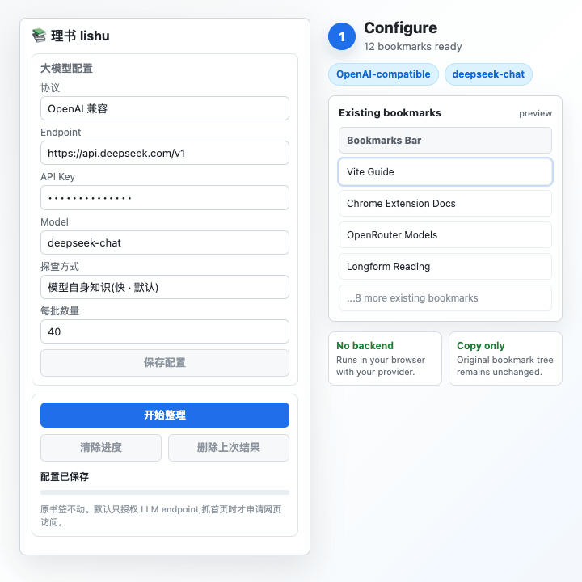

# Lishu (理书)

[](LICENSE)

AI-powered Chrome bookmark organizer. Lishu scans your bookmarks, asks your own LLM to classify them, and writes the result into a new folder. Your original bookmark tree is not moved, edited, or deleted.

> 中文：理书是一个 Chrome MV3 扩展，用你自己配置的大模型整理书签。它只创建整理结果副本，不动原书签。



## What It Does

Lishu is for people who have years of saved Chrome bookmarks but do not want a bookmark manager that takes over their data.

1. Reads your bookmark titles and URLs from Chrome.
2. Proposes a small set of practical categories with your configured LLM.
3. Classifies bookmarks into those categories.
4. Shows a category-count preview.
5. Creates a separate output folder only after you confirm.

The original bookmark tree stays where it is, so you can compare the generated result, delete it, or run Lishu again with different settings.

## Why Lishu

- **Non-destructive by design**: output is copied into a new `📚 理书整理 YYYY-MM-DD` folder.
- **Bring your own LLM**: OpenAI-compatible Chat Completions and Anthropic Messages API are supported.
- **Local-first**: no account, no backend, no bundled model key.
- **Preview before writing**: review the category distribution before Lishu creates the output folder.
- **Minimal default permissions**: by default it only asks for your LLM endpoint origin. Broad page access is requested only when you enable homepage meta scraping.
- **Recoverable runs**: progress is saved in `chrome.storage.local`; the last generated output folder can be removed from the popup.

## Safety Model

| Concern | Lishu's behavior |
|---|---|
| Existing bookmarks | Never updates, moves, or deletes original bookmarks. |
| Output | Creates a new generated folder with bookmark copies. |
| API keys | Stored in `chrome.storage.local`, not Chrome sync. |
| Backend | No Lishu server. Requests go from your browser to your configured provider. |
| Host permissions | Default mode requests only your LLM endpoint origin. |

## Install Locally

Requirements:

- Node.js 22+
- pnpm 10+
- Chrome or another Chromium-based browser with extension developer mode

Fast path:

1. Download `lishu-0.0.2.zip` from [Releases](https://github.com/piklen/lishu/releases).
2. Unzip it locally.
3. Open `chrome://extensions`.
4. Enable **Developer mode**.
5. Click **Load unpacked** and select the unzipped folder.

Build from source:

```bash
pnpm install
pnpm build
```

Load the extension:

1. Open `chrome://extensions`.
2. Enable **Developer mode**.
3. Click **Load unpacked**.
4. Select the generated `dist/` directory.
5. Open Lishu from the toolbar, configure your LLM endpoint, API key, and model, then click **开始整理 / Start organizing**.
6. Review the category preview, then click **确认写入副本 / Confirm write copy**.

## LLM Configuration

OpenAI-compatible example:

```text
Protocol: OpenAI compatible
Endpoint: https://api.openai.com/v1
Model: gpt-4o-mini
```

Anthropic example:

```text
Protocol: Anthropic Messages API
Endpoint: https://api.anthropic.com/v1/messages
Model: claude-...
```

OpenAI-compatible endpoints also work with providers such as DeepSeek, OpenRouter, LiteLLM, Ollama-compatible gateways, and private API gateways as long as they expose `/chat/completions`.

See [docs/PROVIDERS.md](docs/PROVIDERS.md) for copy-paste provider examples.

## Privacy And Permissions

Lishu stores configuration in `chrome.storage.local`.

- API keys are not synced through Chrome sync.
- There is no Lishu server.
- In the default mode, Lishu sends bookmark titles and URLs only to the LLM endpoint you configure.
- If you enable **homepage meta scraping**, Lishu requests broader page access and fetches only homepage metadata such as `<title>` and meta description.
- Original bookmarks are not deleted, updated, or moved.

See [docs/ARCHITECTURE.md](docs/ARCHITECTURE.md) for the full data flow.

## FAQ

**Can Lishu mess up my existing bookmarks?**

The organizing pipeline only creates folders and bookmark copies. It does not call `chrome.bookmarks.update` or `chrome.bookmarks.remove` on original bookmarks.

**Can I undo a generated result?**

Yes. The popup can delete the last generated `📚 理书整理 ...` output folder. It refuses to delete folders that were not generated by Lishu.

**Does Lishu send my bookmarks to a server?**

Lishu has no server. Bookmark titles and URLs are sent directly from your browser to the LLM endpoint you configure.

**Can I review the result before anything is written?**

Yes. Lishu first shows a category-count preview. It creates the generated output folder only after you confirm.

**Why does meta scraping request broad page access?**

Chrome requires host permissions before an extension can fetch arbitrary website homepages. Lishu requests broad access only when you choose the homepage meta mode; the default mode only requests your LLM endpoint origin.

## Development

```bash
pnpm install
pnpm dev
pnpm typecheck
pnpm test
pnpm build
pnpm package:extension
bash scripts/check-secrets.sh
```

Project layout:

```text
src/background.ts      Extension service worker
src/popup/             Popup UI
src/core/              Bookmark scan, classification, pipeline, storage
src/providers/         LLM and enrichment providers
docs/                  PRD, architecture, roadmap
```

## Roadmap

- [Duplicate and dead-link detection mode](https://github.com/piklen/lishu/issues/7)
- [Restore automatic CI after GitHub Actions billing is fixed](https://github.com/piklen/lishu/issues/8)
- Chrome Web Store packaging

## Contributing

Bug reports, focused pull requests, and provider integrations are welcome. Start with [CONTRIBUTING.md](CONTRIBUTING.md). New contributors can start with [good first issues](https://github.com/piklen/lishu/issues?q=is%3Aissue%20is%3Aopen%20label%3A%22good%20first%20issue%22).

## License

MIT. See [LICENSE](LICENSE).
