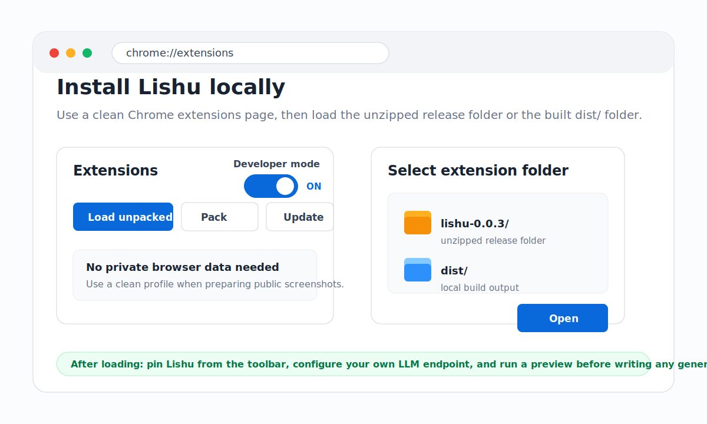

# Install Visual Guide

Lishu is installed through Chrome developer mode until Chrome Web Store publishing is complete.

Microsoft Edge follows the same local extension flow through `edge://extensions`.

## Load From A Release Zip

1. Download [`lishu-0.0.3.zip`](https://github.com/piklen/lishu/releases/download/v0.0.3/lishu-0.0.3.zip) directly, or open the official [GitHub Releases](https://github.com/piklen/lishu/releases) page to confirm the source.
2. Unzip the file locally.
3. Open `chrome://extensions`.
4. Enable **Developer mode**.
5. Click **Load unpacked**.
6. Select the unzipped `lishu-0.0.3/` folder, not the zip file.

## Load From Source

1. Run `pnpm install`.
2. Run `pnpm build`.
3. Open `chrome://extensions`.
4. Enable **Developer mode**.
5. Click **Load unpacked**.
6. Select the generated `dist/` folder, not the repository root.

## Microsoft Edge

1. Open `edge://extensions`.
2. Enable **Developer mode**.
3. Click **Load unpacked**.
4. Select the same unzipped release folder or generated `dist/` folder.

## Public Screenshot Safety

- Use a clean Chrome profile when preparing public install screenshots.
- Do not show personal accounts, private bookmarks, API keys, private URLs, or unrelated extensions.
- The visual above is synthetic and does not contain user data.
